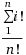

CoolTools v1.0
==============

It has following features.

__Class Primes__
- esieve
- first_n_primes
- primes
- primes_generator
- xprimes_generator
- is_prime
- Miller_Rabin
- prime_factors

__Class Numtools__
- num_divisors
- fast_fib
- fibonacci_generator
- find_minmax
- pandigitals_generator
- is_pandigital
- is_signed_perm
- partitions
- digital_root
- total_inc_dec
- compare_floats
- frange

__Class Joins__
- full_outer_join

__Class Sorts__
- counting_sort
- heap_sort
- is_sorted

__Class Math__
- partial_permutation
- binomial_coefficient
- sum_arithmetic_series
- sum_arithmetic_progression
- sum_square_series
- sum_cubic_series
- sum_tetrahedral_series
- manhattan_distance
- euclidean_distance
- fact_sum_divby_fact
- euler_totient
- reduced_fractions
- left_riemann_sum

__Class Algorithms__
- jaccard_index
- jaccard_distance
- lcs
- levenshtein_distance
- substring_counter
- kmp
- find_word
- find_rot_index
- two_sum
- max_subarray_sum
- lis
- kth_smallest
- smallest_positive_missing


_Note_ <br>
&nbsp; ```fact_sum_divby_fact``` explanation
&nbsp; 